# Hi, I'm Kamar 👋

I'm a Computer Science graduate currently pursuing a Master's degree in Artificial Intelligence and Digitalization at Université Ibn Khaldoun de Tiaret, Algeria. I build full-stack applications and work on AI/ML projects, and I'm currently looking for Junior Software Developer / AI-related roles, open to relocation to Cologne, Germany.

## 🛠️ Tech Stack

- **Languages:** Python, Java
- **Frameworks & Mobile:** React, Flutter
- **Databases:** MySQL, Firebase
- **Tools:** Git, AI/ML model training

## 📌 Featured Project

**TrailFinder** — A social travel-discovery app with a relational database design (13 tables) covering places & categories with geolocation, user profiles, friend networks, group messaging, favorites, and notifications. Built collaboratively with Flutter/React frontend and MySQL backend as a final-year project.

## 📫 Contact

- Email: kamarben004@gmail.com
- Open to relocation to Cologne, Germany 🇩🇪
